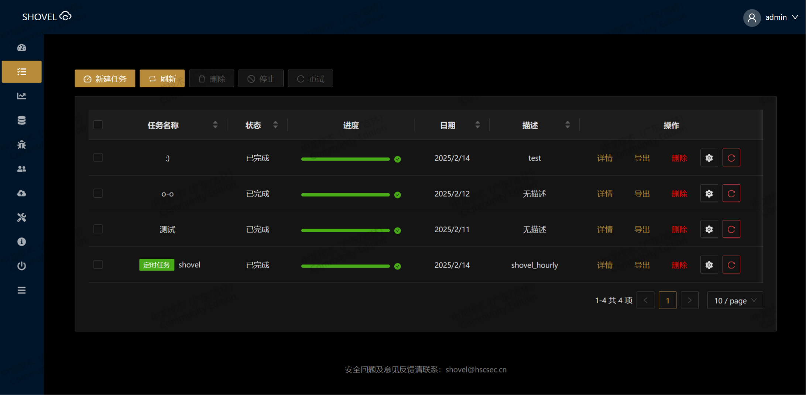

<div align="center">
  <a href="https://www.hscsec.cn">
    
  </a>
  <h1>
    <b>SHOVEL</b>
  </h1>
  

<a href="https://git.io/typing-svg"></a>

<p align="center">
    <a href="#-重新定义企业资产管理范式">🔍 概述</a> •
    <a href="#-核心优势">🚀 核心优势</a> •
    <a href="#-快速部署">⚡ 快速部署</a> •
    <a href="#-插件生态系统">🧩 插件生态</a> •
    <a href="#-贡献指南">🤝 参与贡献</a>
  </p>

[](https://reactrouter.com/)
[](https://ant.design/)
[](https://maplibre.org/)
[](https://hammerjs.github.io/)
[](https://nginx.org/)


  <p>
    <sub>
      Powered with ❤️ by
      <a href="https://www.hscsec.cn">
        <b>HSC Security</b>
      </a>
    </sub>
  </p>
</div>

  <br />

  <p>
    
  </p>
</div>


### 🔍 重新定义企业资产管理范式

**Shovel** 是一款面向现代企业安全团队的开源资产测绘平台。通过融合主被动扫描引擎、多模态数据关联分析和智能风险评估模型，我们致力于为企业提供更优雅的资产治理解决方案。

------

### 🚀 核心优势

- **多维资产画像**
  深度整合CMDB/云平台/漏洞库数据源，构建包含2000+指纹规则的资产知识图谱，智能生成空间资产图谱。
- **风险决策中枢**
  内建漏洞优先级算法（CVSS 3.1/EPSS双模评估），结合资产业务价值生成动态风险矩阵。
- **开放架构设计**
  提供标准化OpenAPI和插件API，可实现与主流SIEM/SOAR平台的无缝对接
- **高扩展性插件系统**
  内置高性能管道式插件系统，可灵活地对执行逻辑树进行节点的增删改查，快速将工作流落地。
- **核心 & 中间层分离式架构**
  分离式架构支持灵活分层部署，可快速实现分布式、链式及边缘设备等多种运行模式。

### 🌟 为什么选择Shovel？
更智能：AI驱动的资产发现与风险评估

更高效：分钟级完成B段资产测绘

更开放：丰富的API和插件生态

更灵活：支持多种部署模式，适应不同规模企业需求


### ⚡ 快速部署

```
# 使用Docker-Compose启动标准集群
git clone https://github.com/your-repo/shovel.git && cd shovel/deploy
docker-compose -f standalone.yml up -d

# 访问管理界面
echo "控制台地址: http://$(curl -s ifconfig.me):8000"
```


### 🧩 插件生态系统

#### 官方插件集（持续更新）

| 插件名称                | 功能描述                                                                 | 标签                                                                 |
|-------------------------|--------------------------------------------------------------------------|----------------------------------------------------------------------|
| **Fingerprinter**       | 根据任务中的URL信息进行CMS指纹识别                                       | `info-collecting`, `collector`, `discovery`, `identification`, `CMS` |
| **Nmapper**             | 根据任务中的Host信息，使用Nmap扫描器进行端口探测并识别服务               | `info-collecting`, `collector`, `network`, `nmap`, `port`, `discovery`, `CIDR` |
| **Fofa_Mapper**         | 根据任务中的域名信息，使用FOFA进行信息收集                               | `info-collecting`, `collector`, `domain`, `FOFA`                     |
| **Http_Port_Visitor**   | 根据任务中的开放端口信息，进行相关Web服务的信息收集                      | `httpx`, `info-collecting`, `collector`, `ports`, `http`             |
| **Company_Investigator**| 根据任务中的公司/集团名进行ICP备案信息收集                               | `info-collecting`, `collector`, `company`, `enscan`, `unstable`      |
| **Domain_Seeker**       | 根据任务中的域名信息，进行子域名信息收集                                 | `info-collecting`, `collector`, `website`, `discovery`, `domain`, `DNS`, `amass` |
| **Nuclei_Reactor**      | 根据任务中的URL信息，使用Nuclei扫描器进行漏洞检测                        | `vulnerability`, `detection`, `nuclei`, `exploit`, `CVE`             |

---

### 🛠️ 插件开发指南（即将发布）

我们正在编写详细的插件开发文档，包括：
- **插件开发框架详解**：从零开始构建一个插件
- **核心API参考手册**：了解Shovel提供的核心接口
- **插件调试与测试**：如何高效调试和验证插件功能
- **插件发布流程**：将你的插件贡献到官方或社区插件库

---

### 🌱 欢迎贡献插件

我们鼓励开发者参与插件生态建设：
1. **提交插件**：将你的插件代码提交到我们的[插件仓库](https://github.com/your-repo/shovel-plugins)
2. **插件审核**：经过审核后，优质插件将被纳入官方插件库
3. **社区奖励**：贡献者将获得专属荣誉标识和社区积分

---

### 📢 温馨提示

- **插件编写指南**：详细的插件开发Wiki将在近期发布，敬请期待！
- **插件反馈**：如果你对现有插件有任何建议或发现问题，欢迎提交[Issue](https://github.com/your-repo/shovel/issues)
- **插件需求**：如果你有新的插件需求，欢迎在[讨论区](https://github.com/your-repo/shovel/discussions)提出

---

让我们一起打造更强大的Shovel插件生态！🚀
